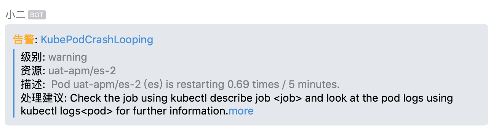

### 运行
1. k8s
```bash
kubectl apply -f deployment.yaml
```

1. docker-compose
```bash
docker-compose up -d
```

1. docker:
```bash
docker run -d --name=work_wechat_robot -p 8080:8080 daozzg/work_wechat_robot 
```


### promethues webhook 配置
1. 创建robot,获得robot的key,根据自己的alertmanager 规则，修改如下alertmanager的配置:
    1. <your robot key>: 你的robot的key
    1. <work-wechat-robot>: 部署本服务的地址,如果是同k8s的[deployment部署](./deployment.yaml)，写service名即可，如: http://http://work-wechat-robot/prometheus_webhook
```bash
"global":
  "resolve_timeout": "5m"
"route":
  "group_by":
  - "job"
  "group_interval": "5m"
  "group_wait": "30s"
  "receiver": "default"
  "repeat_interval": "12h"
  "routes":
  - "match":
      "alertname": "DeadMansSwitch"
    "receiver": "null"
"receivers":
- "name": "default"
  "webhook_configs":
  - "send_resolved": true
    "url": "http://<work-wechat-robot>/prometheus_webhook"
    "http_config":
       "bearer_token": "<your robot key>"
```
1. 建议配置Prometheus 启动参数 `--web.external-url`,这样点击告警名能够跳转到 prometheus查看告警到监控信息(如果是prometheus-operator,增加spec.externalUrl)
### 规范
为了更好的显示告警信息，请参考[告警规范 Kubernetes Alert Runbooks](https://github.com/kubernetes-monitoring/kubernetes-mixin/blob/master/runbook.md#kubernetes-alert-runbooks):
如果按照规范，会接收到如下的告警信息



### 开发
```
git clone {this_url}
cd work_wechat_robot
# please install pip (ubuntu: `apt-get install python-pip`,mac: `brew install python-pip` )
pip install virtualenv
virtualenv venv
source venv/bin/activate

pip install -r requirements.txt
python app.py

```
更新依赖
